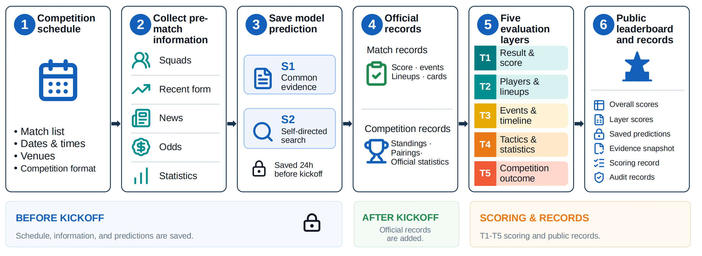
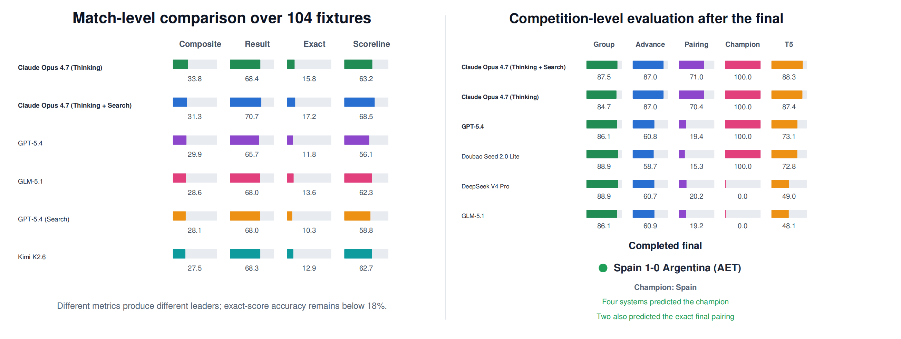
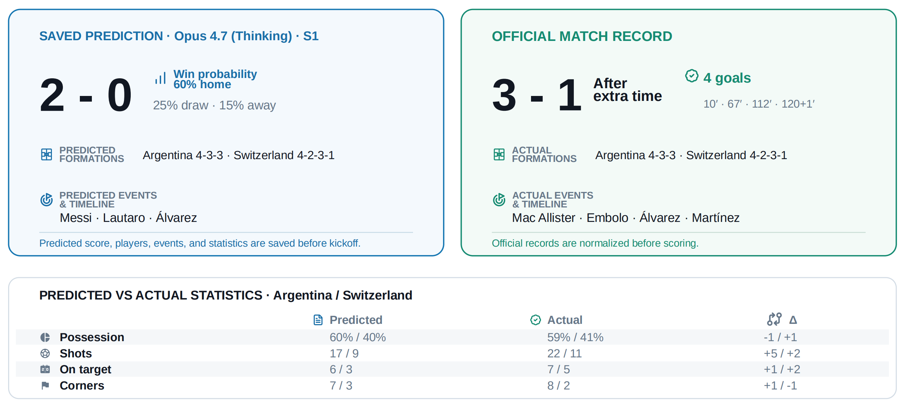
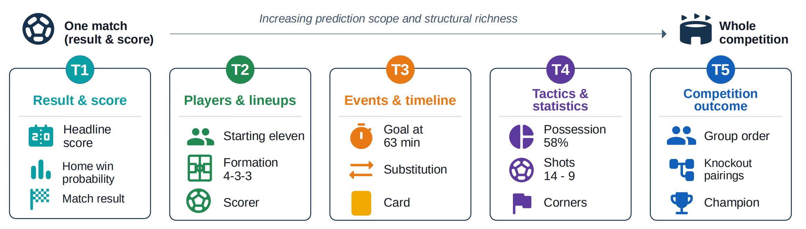
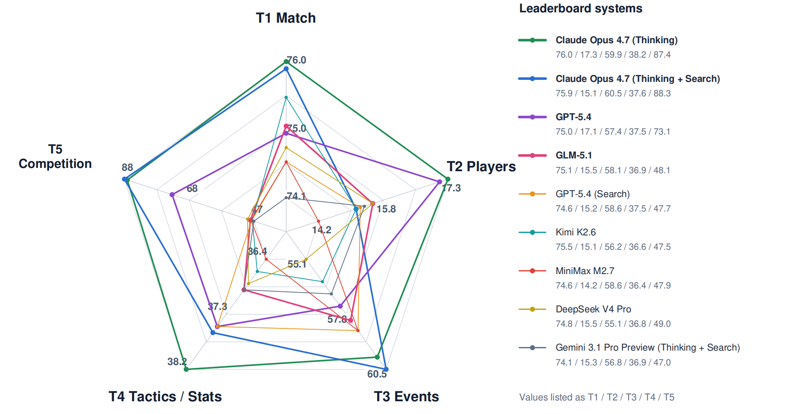
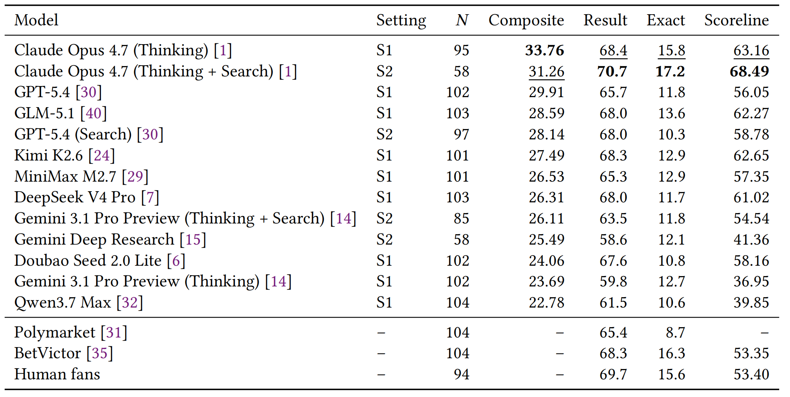
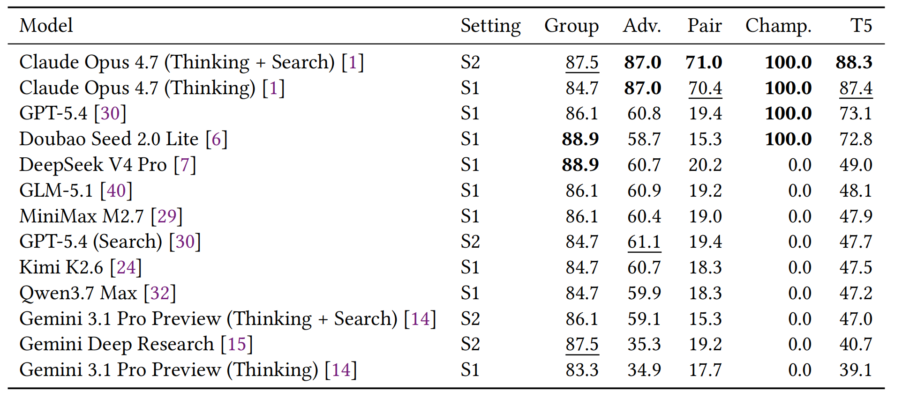
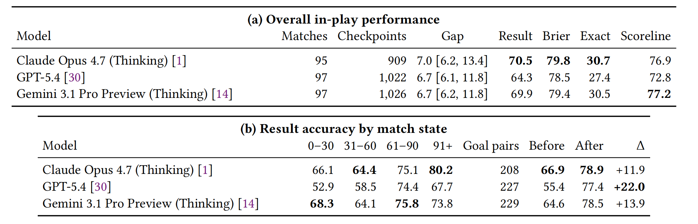

# ⚽️🤖 WorldCupArena

WorldCupArena is a dynamic benchmark for evaluating language models and deep-research agents on football forecasting, from match results and scorelines to players, events, statistics, and full-competition outcomes.


[[Leaderboard]](docs/matchmate_predict.md) | [[Tech Report]](https://arxiv.org/pdf/2607.18084) | [[Usage]](docs/usage.md)


---

<div align="center">
  
</div>

---

<div align="center">
  
</div>

---

## Why

Most language-model benchmarks are built from questions whose answers already exist. Football offers a different test: a system must collect changing pre-match evidence, commit to a forecast before kickoff, and wait for objective ground truth. A single fixture also produces much richer evidence than a winner alone, including lineups, scorers, cards, substitutions, and match statistics.

The 2026 FIFA World Cup is our first complete evaluation. The benchmark is not tied to this tournament: the same snapshot, prediction, and post-match grading pipeline can be applied to future leagues and cups by supplying their fixtures, competition rules, and truth adapters.

## Current release


| Item | Coverage |
|---|---|
| Competition | All **104 matches** of the 2026 FIFA World Cup |
| Systems | **13** model and agent variants across two evidence settings |
| Pre-match track | Result, scoreline, players, events, and statistics for every fixture |
| Competition track | Group order, knockout progression and pairings, finalists, and champion |
| In-play track | **2,957** valid checkpoints from **100** matches and three models |
| Ground truth | Structured post-match records plus the completed tournament outcome |

Valid prediction coverage can differ by system when a provider call fails or a response does not pass validation.

<div align="center">
  
</div>


## What we measure

<div align="center">
  
</div>


| Layer | Task examples | Primary metric |
|---|---|---|
| **T1 Core result** (40%) | 1X2 probabilities, exact score, scoreline closeness, goal difference | Brier, exact accuracy, scoreline score, MAE |
| **T2 Player level** (20%) | starting XI, formation, goalscorers, assisters, player of the match | Jaccard, F1, nDCG, top-1 accuracy |
| **T3 Event level** (15%) | goal minute, subs, cards, penalties | Hungarian-matched MAE, event-F1 |
| **T4 Tactics & stats** (15%) | formation, possession, shots, corners, passing, fouls, saves | exact match, sMAPE |
| **T5 Competition level** (10%) | group standings, round-by-round advancement and pairings, champion | Kendall tau, bracket score, top-1 accuracy |

The public leaderboard reports several views rather than reducing every forecast to one number:

- **Composite** combines T1-T5 using the weights above. A fixed monotonic transform is applied after averaging so that small raw differences remain visible without changing system order.
- **Result accuracy** checks whether the predicted home win, draw, or away win is correct.
- **Exact-score accuracy** requires both teams' predicted goal counts to match the final score exactly.
- **Scoreline score** rewards exact predictions and gives decreasing credit for near misses based on the result, goal difference, total goals, and each team's goals.
- **Layer profile** shows T1-T5 separately, including the completed competition-level evaluation.

Tasks are scored only when the required prediction and ground truth are available. See [configs/tasks.yaml](configs/tasks.yaml) for the current weights and metric mapping.

<div align="center">
  
</div>

## Who we test

The released leaderboard currently contains 13 systems (defined in [configs/models.yaml](configs/models.yaml)):

- **Context-fed models (S1):** Claude Opus 4.7 (Thinking), GPT-5.4, Gemini 3.1 Pro Preview (Thinking), DeepSeek V4 Pro, GLM-5.1, Kimi K2.6, MiniMax M2.7, Doubao Seed 2.0 Lite, and Qwen3.7 Max.
- **Search-enabled models (S2):** search variants of Claude Opus 4.7, GPT-5.4, and Gemini 3.1 Pro Preview.
- **Deep-research agent (S2):** Gemini Deep Research.

The technical report additionally compares applicable match-level metrics with Polymarket, BetVictor, and a 152-person football-fan baseline. These baselines do not produce the full set of player-, event-, or competition-level predictions.

Model entries support provider-specific endpoints and environment-variable overrides, so hosted or proxy-compatible deployments can be selected without changing benchmark outputs.

## Setting matrix

Two settings separate forecasting with common evidence from self-directed retrieval:

| Setting | Injected context | Tools | Run by |
|---|---|---|---|
| **S1** | frozen context pack with squads, recent form, news, statistics, and odds when available | off | context-fed models |
| **S2** | fixture header plus guidance on evidence to gather | on | search-enabled models and research agents |

S1 gives systems the same prepared evidence package. S2 gives no context pack and asks each system to find its own evidence before the prediction cutoff. See [configs/settings.yaml](configs/settings.yaml) for the exact injection and tool policy.

## Prediction tracks

### Pre-match forecasting

For each fixture, a model predicts the 1X2 result and probabilities, an exact headline score, likely lineups and players, match events, and team statistics. Predictions are locked before kickoff and graded after structured truth is available.

<div align="center">
  
</div>

### Full-competition forecasting

Before the tournament, systems predict all group tables and a complete knockout path. T5 combines group-order agreement, round-weighted advancement and exact-pairing credit, and champion accuracy. The completed 2026 World Cup truth is stored in [configs/world_cup_2026_truth.json](configs/world_cup_2026_truth.json).

<div align="center">
  
</div>

### In-play forecasting

The optional live runner repeatedly records the current match state and asks selected models for updated result probabilities and scorelines. The current analysis uses the checkpoints that were actually captured, not an assumed fixed interval: the median wall-clock gap is 6.8 minutes, with an interquartile range of 6.2-12.4 minutes. Records are stored under `data/live_predictions/` with their full history.

<div align="center">
  
</div>

## Repo layout

```
configs/       fixtures, models, settings, task weights, competition spec and truth
schemas/       fixture and prediction JSON schemas
prompts/       per-match and full-competition prompts
src/
  ingest/      football data, news and odds adapters
  runners/     provider-specific model clients
  graders/     match and competition metrics
  pipeline/    snapshots, validation, prediction, live and tournament runners
  leaderboard/ aggregation and static-site payload generation
data/
  snapshots/                  frozen pre-match inputs and post-match truth
  predictions/                pre-match model outputs
  results/                    graded per-match outputs
  live/                       provider match-state snapshots
  live_predictions/           in-play model histories
  tournament_context/         prepared competition-level evidence
  tournament_predictions/     full-competition forecasts
  search_logs/                archived S2 sources
  i18n/                       site translation data
docs/site/                    bilingual static leaderboard
tests/                        scoring tests
worldcup写作/                 LaTeX technical report and analysis scripts
```

## Lifecycle of a fixture

```
register fixture
      |
      v
ingest and populate context
      |
      v
freeze snapshot at the configured cutoff and run pre-match predictions
      |
      +---- optional in-play state and prediction updates
      |
      v
fetch final truth, grade all valid outputs, and rebuild the site
```

`src.pipeline.scheduler` implements the idempotent `ingest`, `populate`, `lock_predict`, `live_update`, and `truth_grade` phases and is designed for a short-interval cron. Full-competition predictions and in-play model calls are separate runners because they have different schedules and costs. The Pages workflow rebuilds and deploys the bilingual site when relevant data or site code changes on `main`.

## Quickstart

```bash
python3 -m venv .venv
source .venv/bin/activate
pip install -r requirements.txt
cp .env.example .env

python -m src.pipeline.scheduler show
python -m src.leaderboard.build_site
```

Common commands:

```bash
# Run every currently due fixture phase
python -m src.pipeline.scheduler tick

# Inspect models available for full-competition forecasting
python -m src.pipeline.tournament_predict list-models

# Check a tournament run without calling a provider
python -m src.pipeline.tournament_predict run --models gpt-5.4 --dry-run

# Run the scoring tests
python -m unittest discover -s tests
```

Full step-by-step usage lives in [docs/usage.md](docs/usage.md). To add a provider or model, see [docs/integration.md](docs/integration.md).

## Reproducibility and integrity

- Each pre-match fixture is stored as a frozen snapshot with a hash and information cutoff.
- Outputs are checked against JSON Schema and semantic constraints, including normalized probabilities, agreement among the predicted result, headline score, and probability argmax, complete starting lineups, and required reasoning fields.
- Invalid outputs receive a targeted repair prompt, up to the retry limit in [configs/settings.yaml](configs/settings.yaml).
- S2 sources and timestamps are archived so information published after the cutoff can be audited.
- Model-owned predictions are kept separate from deterministic score-distribution derivatives generated by the pipeline.

## Status and next steps

- [x] Complete 104-match 2026 World Cup release
- [x] Thirteen-system pre-match leaderboard with T1-T5 profiles
- [x] Completed competition-level grading through the final
- [x] In-play prediction histories and time-stratified analysis
- [x] Bilingual static leaderboard and GitHub Pages deployment

Contributions are welcome, especially new model runners, football-data adapters, competition specifications, and reproducibility checks.

## License

MIT. Predictions, prompts, and grading code are all open; model outputs are attributed to each vendor.

## Citation

```
@article{WorldCupArena,
  title={WorldCupArena: Fine-Grained Evaluation of Language Models and Deep-Research Agents on Football Forecasting},
  author = {Wang, Zhaokai and Gui, Tianlin and Rao, Jiayuan and Di, Shangzhe and Tang, Yihong and Liang, Dingli},
  journal={arXiv preprint arXiv:2607.18084},
  year={2026}
}
```
